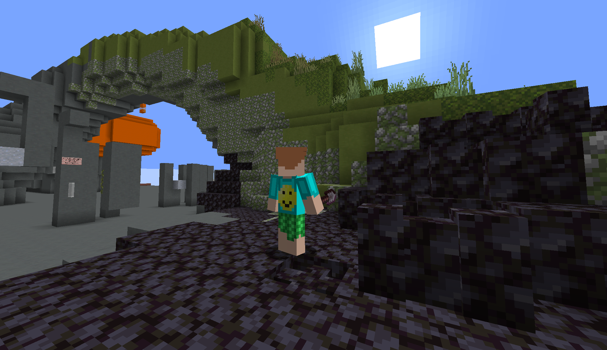
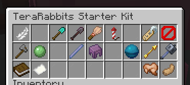

<!-- minrdocs:mapping --> <!-- minrdocs:github https://github.com/x3a1n4/Minr -->
<!-- utilityinfo:name TeraRabbits -->
<!-- utilityinfo:author eggshells -->
<!-- utilityinfo:dependencies StringHashMap -->
<!-- utilityinfo:description A bundle of Minr scripts to replicate the most useful bits of worldedit + axiom -->

# TeraRabbits
This is an msc implementation of my favourite worldedit features!

## How to use
1. Get an admin to import a binding script
2. Get a **TeraRabbits Starter Kit** from someone on the server
3. Make sure that you are **an owner of the region** you want to build in
4. Have fun!

!!! note "Important info"

    - On starting teraRabbits, you are given a "stop" barrier. **Right click this to exit**
    - By default, teraRabbits changes placement to "replace" mode. **Where possible, blocks are substituted**
        - Example: right clicking on a stone wall with brick blocks will turn it into a brick wall
    - There are a number of useful tools, which I can be bothered to list at somepoint in the future.
    - Brushes can take a size argument in square brackets, up to a maximum of `6`.
    - **The items themselves do not matter, just their names.**

## Namespaces
- [`teraRabbitsUtils`](teraRabbitsUtils/index.md)
- [`teraRabbitsTools`](teraRabbitsTools/index.md)
- [`teraRabbits`](teraRabbits/index.md)
