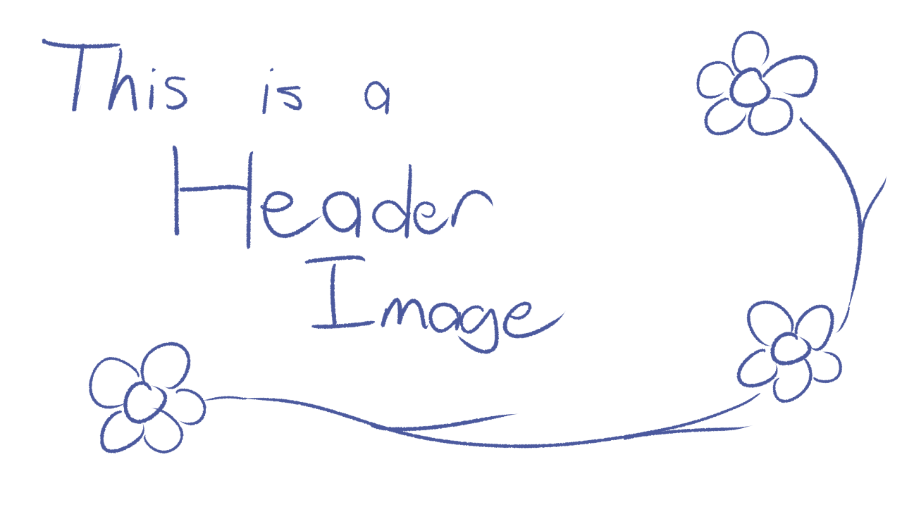

<!-- minrdocs:mapping --> <!-- minrdocs:msc --> <!-- minrdocs:github https://github.com/x3a1n4/minr -->
<!-- minrscript:name TeraRabbits -->
<!-- minrscript:author eggshells -->
<!-- minrscript:description Minr scripts for many worldedit + axiom features I like -->

{ align=left }

# TeraRabbits
This is a small project for holding worldedit stuff, I'll complete this later