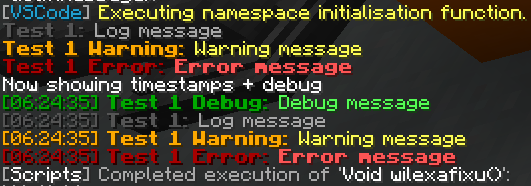

<!-- minrdocs:scripting --> <!-- minrdocs:msc -->
<!-- utilityinfo:name logger -->
<!-- utilityinfo:author eggshells -->
<!-- utilityinfo:dependencies slytools -->
<!-- utilityinfo:description A small logger utility that sends messages to a player (or list of players) with tellraw -->

# logger

This is a small utility library to print messages to a list of players.

!!! note "Why not use `@player`?"
    `@player` works in 99% of cases, and is usually preferable! This library is meant for edge cases where

    - `@player` is not available (such as being invoked through `@console /function execute`)
    - You want to log concurrently to many players at the same time
    - You want a consistent set of formatting across your logs



This is a small utility namespace that supports debugs, logs, warnings, and errors to a player or list of players. This namespace uses `/tellraw` commands and [slytools Text to Tellraw utility](https://discord.com/channels/190350281580478466/488226184648458241/884385848999690260) to allow for custom formatting, as well as in-built support for timestamps.

### Example code (from `tests()`)
<div class="annotate breakword" markdown>
```
@define logger::Logger logger = logger::Logger("Test 1") (1).setPlayerList(Player[p]) (2)

@var logger.debug("Debug message")
@var logger.log("Log message")
@var logger.warning("Warning message")
@var logger.error("Error message")

@player Now showing timestamps + debug
@var logger.showDebug(true).showTimestamps(true) (3)
@var logger.debug("Debug message")
@var logger.log("Log message")
@var logger.warning("Warning message")
@var logger.error("Error message")
```
</div>

1. This is the name of the logger. By default, it is printed in bold at the start of each log.
2. To use the `Logger` class, you need to specify what players you want to log to. Here, `p` is just defined to be `player`.
3. Most functions in the logger class return the logger object, allowing for single-line definitions such as this.

## Classes
| Class                               | Description                    |
| ----------------------------------- | ------------------------------ |
| [`Logger`](Logger.md) | The logger object |

## Functions
| Function                             | Description                                           |
| ------------------------------------ | ----------------------------------------------------- |
| <!-- minrdocs:internal --> `Void tests(Player p)` | Unit tests |