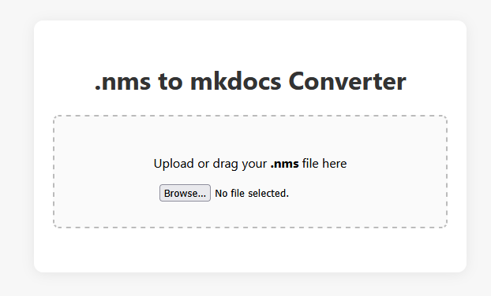

<!-- minrdocs:scripting --> <!-- minrdocs:github https://github.com/x3a1n4/nms-to-md --> <!-- minrdocs:website https://x3a1n4.github.io/nms-to-md/ -->
<!-- utilityinfo:name .nms to mkdocs Converter -->
<!-- utilityinfo:author eggshells -->
<!-- utilityinfo:no_dependencies -->
<!-- utilityinfo:description A utility website for generating documentation from .nms files -->

# [.nms to mkdocs Converter](https://x3a1n4.github.io/nms-to-md/)

This is a utility website that generates a documentation structure from an uploaded .nms file. 
It doesn't do *everything* automatically, but it gets pretty far.

## Features:
- Generates a file for each class called `[ClassName].md`
- Generates an `index.md` file for each namespace
- Generates a `index.md` file for the project as a whole
- Attempts to use comments above members as descriptions
- Generated folder can simply be dropped into the [Minr Player Utilities `minr_scripts` folder](https://github.com/x3a1n4/minr-docs/tree/main/docs/minr_scripts)

Credit to Lightwood13 for the .nms parser in the [Minr Scripts vscode extension](https://marketplace.visualstudio.com/items?itemName=Lightwood13.msc), which this project is fundamentally based on!

**Check out the site [**here**](https://x3a1n4.github.io/nms-to-md/)!**

