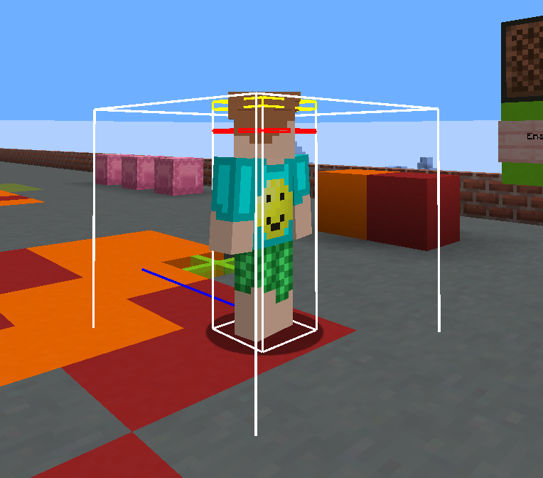

<!-- minrdocs:scripting --> <!-- minrdocs:msc -->
<!-- utilityinfo:name playerclickhandler -->
<!-- utilityinfo:author eggshells -->
<!-- utilityinfo:dependencies worldUtils -->
<!-- utilityinfo:description A utility for spawning and binding interact entities that ride the player -->

# playerclickhandler
This is a scripting utility that allows for spawning and binding interact entities that ride the player. Essentially, it allows for right-click scripts.

### Example Code
<div class="annotate breakword" markdown>
```
@define InteractEntity ie = InteractEntity(player) (1)
@var ie.setRemainingUses(5) (2)
@var ie.onInteractBindings.add("playerclickhandler::tests") (3)
@var ie.onKillBindings.add("playerclickhandler::testLog") (4)
```
</div>

1. Create the InteractEntity, and make it follow the player `player`
2. Set the number of uses on the InteractEntity to `5`. This makes it such that the entity can be clicked five times before disabling.
3. Bind the function `playerclickhandler::tests(Player player)` to onInteractBindings. This is triggered every time the player clicks the entity. <br/>
   **Note that the function is defined as `tests(Player player)`.** Functions must take a player input to be bound.
4. Bind the function `playerclickhandler::testLog(Player player)` to onKillBindings. This is triggered when the entity dies, which will happen after five clicks. 



## Classes
| Class                               | Description                    |
| ----------------------------------- | ------------------------------ |
| [`BindingList`](BindingList.md) | A class that holds a list of functions to be triggered |
| [`InteractEntity`](InteractEntity.md) | The entity that the player interacts with |

## Functions
| Function                             | Description                                           |
| ------------------------------------ | ----------------------------------------------------- |
| <!-- minrdocs:internal --> `Void onInteract(Player player, Entity entity)` | Called on any interact. This function has a wrapper! |
| <!-- minrdocs:internal --> `Void tests(Player player)` | Unit tests |
| <!-- minrdocs:internal --> `Void testLog(Player player)` | More unit tests |

## Variables
| Variable                                     | Description                                                              |
| -------------------------------------------- | ------------------------------------------------------------------------ |
| <!-- minrdocs:internal --> `InteractEntity playerEntity` | No documentation |
| <!-- minrdocs:internal --> `Int testStage` | Variable used for testing |
